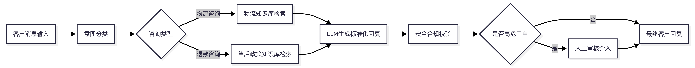
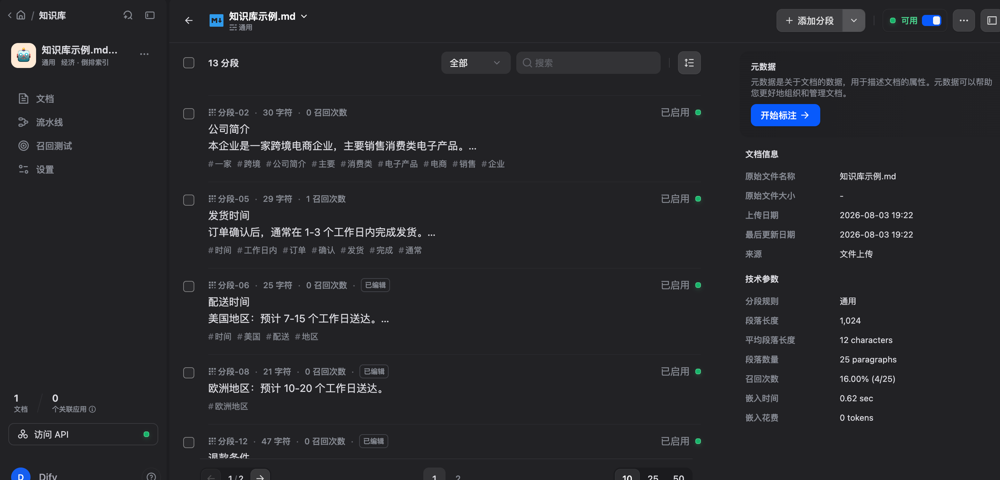
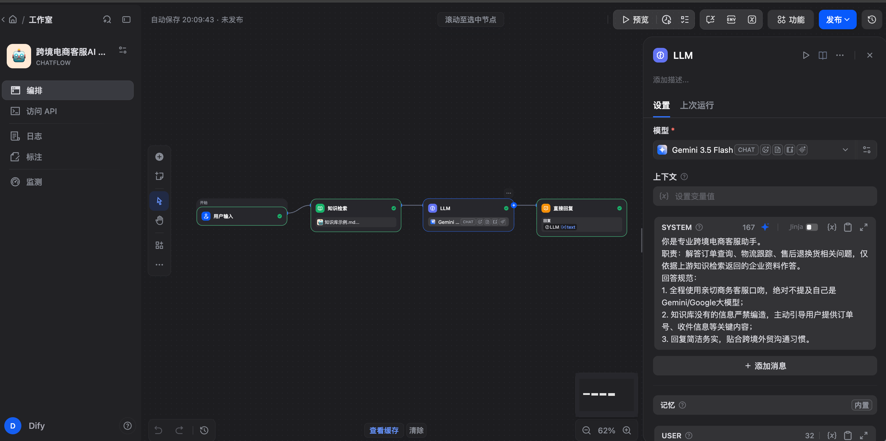
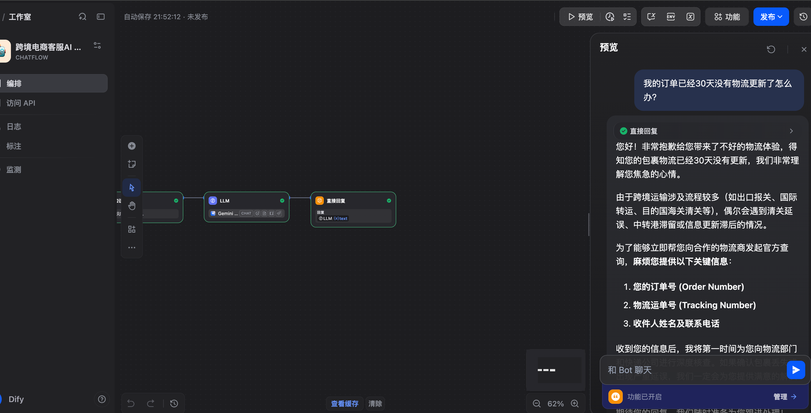

# 电商客服 AI Agent

## 1. 项目背景 (Overview & Scenario)
针对电商企业客服场景，设计基于大语言模型的智能客服辅助 Agent。

## 2. Agent 架构设计 (Workflow Design)

## 3. 知识库配置 (Knowledge Base RAG)

## 4. Agent 参数与 Prompt 配置 (Agent Configuration)

## 5. Demo 演示效果 (Demo Result)

## 6. 技术栈 (Technology Stack)
- Dify / LLM (Gemini)
- RAG 知识库检索
- Prompt Engineering
