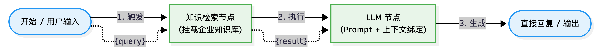
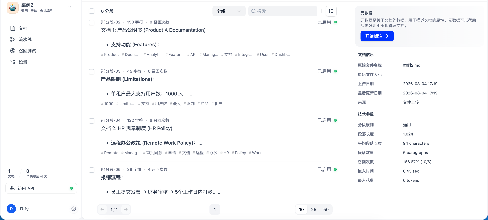
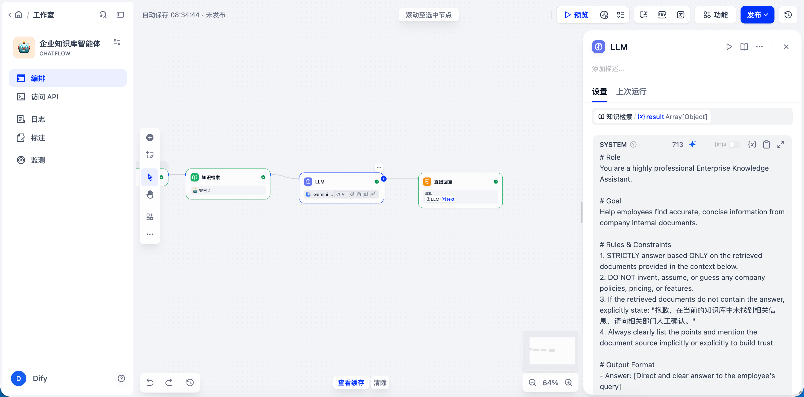
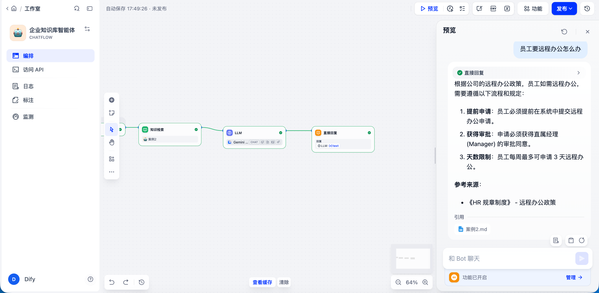

# 🏢 企业知识库智能助手 (Enterprise Knowledge Assistant)

## 📑 项目定位
本项目旨在帮助企业员工通过自然语言快速查询内部知识（如产品手册、HR制度、报销流程等）。基于 RAG (Retrieval-Augmented Generation) 技术，打破企业内部数据孤岛，大幅降低信息检索时间，提高跨部门协作效率。

## 🏗️ 核心架构 (Workflow Architecture)
本项目摒弃了基础的全局上下文模式，采用更严谨的 **工作流 (Chatflow)** 模式构建。
核心数据链路为：`Start -> 知识检索 (Knowledge Retrieval) -> 大模型 (LLM) -> Reply`。通过节点间的显式变量绑定，确保业务数据流转的绝对可靠性。

## 🗂️ 知识库构建 (RAG Setup)
上传企业内部规范文档（源文件见本目录下的 `知识库示例.md`）并进行文本切片（Chunking）。通过合理的段落长度设置与召回参数调优，确保大模型能获取到最精准的上下文。

## 🧠 大模型配置 (LLM Configuration)
编写了结构化的 Prompt（包含 `# Role`, `# Goal`, `# Rules & Constraints`）。
**技术难点突破**：解决了数据传输断层问题，通过**节点变量显式绑定**将检索到的知识库内容强制注入给 LLM。同时设定了严格的输出边界（如未命中知识库时必须输出“未找到相关信息”的标准话术），从根本上防止 AI 产生幻觉 (Hallucination)。

## 💻 效果演示 (Demo)
系统能够准确基于内置的规章制度回答员工的具体问题（如：远程办公申请流程），提取关键步骤，并清晰地附带参考来源，满足企业级应用的严谨性要求。

---
**📂 更多设计细节请参考本目录下的附属文档：**
* [`业务需求分析.md`](./业务需求分析.md)
* [`提示设计.md`](./提示设计.md)
* [`知识库示例.md`](./知识库示例.md)
