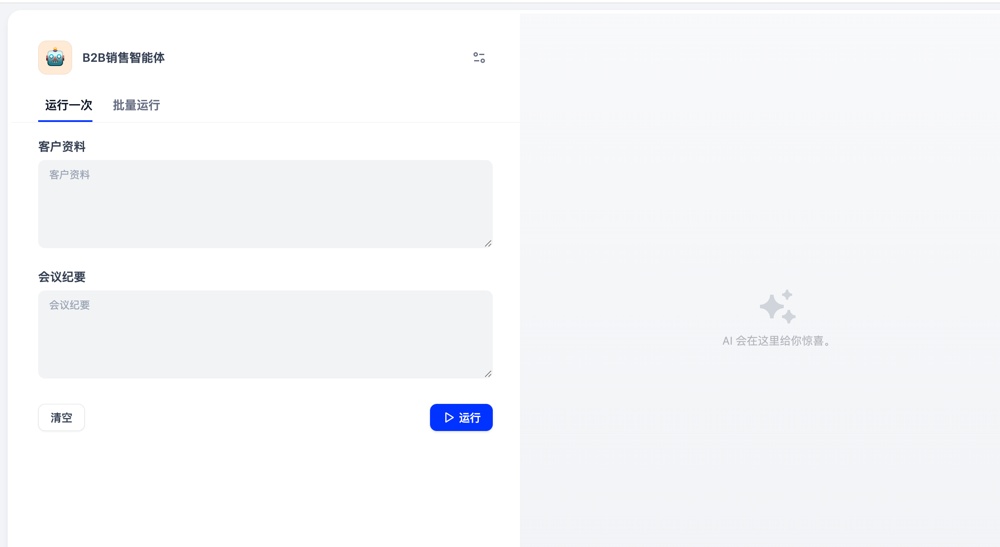
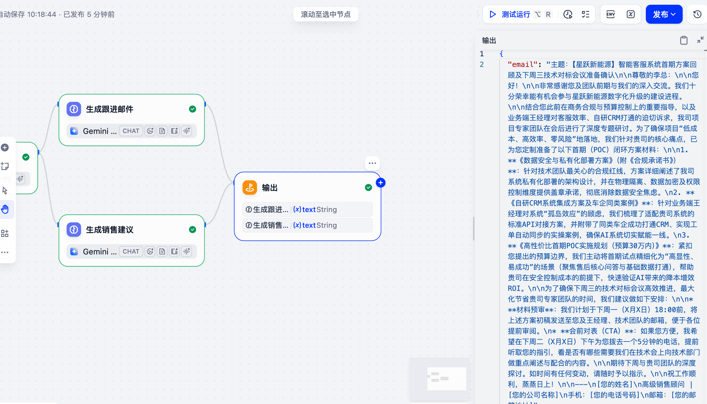
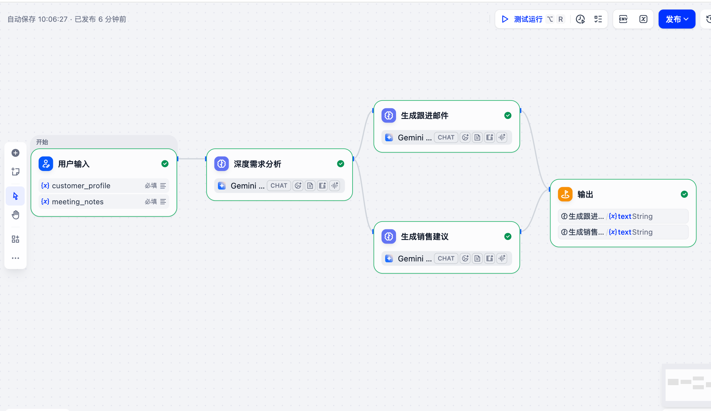

# 🤖 B2B-Sales-Agent-Dify (B2B 销售智能体)

> 基于 Dify + LLM 构建的 B2B 高净值线索销售跟进自动化工作流 (Workflow)。
> 自动解析非结构化会议纪要，快速并发生成“客户跟进邮件”与“内部实战销售策略”。

## 🌟 项目简介 (Introduction)

在复杂的 B2B 销售（如新能源/EV、SaaS、企业服务）场景中，销售人员通常需要耗费大量时间整理会议纪要、分析客户痛点，并字斟句酌地撰写跟进邮件。
本项目通过 Dify 工作流编排，实现从**“原始客情资料”**到**“实战销售弹药”**的自动化转化，极大提升转化效率与成单率。

## 📸 运行效果 (Showcase)

### 1. 极简前端界面 (User Interface)
提供给一线销售人员的清爽操作台，只需输入“客户资料”与“会议纪要”即可一键运行，零学习成本。

### 2. 自动化输出结果 (Output Demo)
> 测试用例：新能源车企 30 万预算客服系统 POC 项目。

系统瞬间并发生成专业的【初次跟进邮件】与带有教练视角的【内部实战销售策略及话术】。

### 3. 全局工作流架构 (Workflow Overview)
展示了从“用户输入 -> 深度需求分析 -> 并行双分支（邮件生成+策略生成） -> 聚合输出”的完整底层逻辑。

## ✨ 核心特性 (Features)

* **🧠 深度需求分析**：精准提取客户痛点、预算情况、决策链条及潜在风险。
* **⚡ 并行处理架构 (Parallel Processing)**：利用 Dify 并行节点，一份上下文同时触发两个维度的输出，效率翻倍。
* **✉️ 自动化邮件起草**：生成专业、礼貌、直击痛点的跟进邮件，自带明确的 Call to Action。
* **🎯 实战销售策略**：针对关键决策人的“杀伤力话术”及项目交付期的“核心风险规避指南”。

## 🚀 快速开始 (Quick Start)

如何在你自己的 Dify 环境中部署并复用此工作流：

1. 登录你的 [Dify](https://dify.ai/) 平台。
2. 在“工作室”点击 **导入 DSL 文件 (Import from DSL)**。
3. 选择本仓库中的 `B2B-Sales-Agent.yml` 文件上传。
4. 配置你自己的 LLM 模型（推荐使用 Gemini 3.5 Flash 或其他支持大上下文的优质模型）。
5. 点击运行或发布，即可开始使用！

## 🛠️ 技术栈与配置 (Tech Stack)

* **应用框架**：Dify (Workflow 工作流模式)
* **大模型引擎**：Gemini 3.5 Flash
* **核心节点**：LLM 节点、Parallel (并行分支)、End (多变量聚合)
* **输入限制**：变量配置为 `Paragraph` 类型，支持大段落非结构化文本的直接粘贴。
