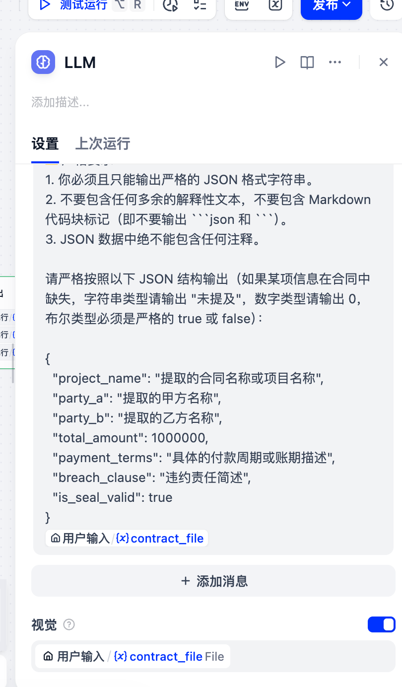
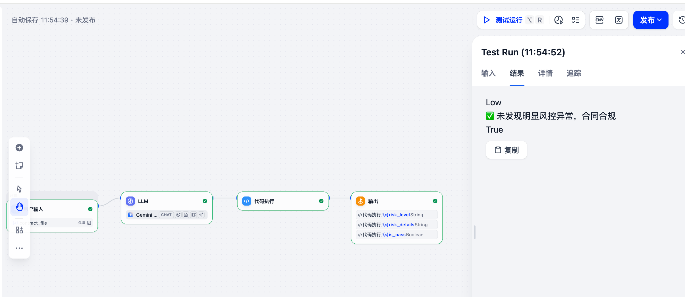

# 商业合同风控审查 AI Agent

基于 **Dify** 与 **Gemini Vision** 打造的自动化商业合同智能风控审查工作流。本项目可自动解析合同图片，校验印章与签名有效性，并提取核心财务与法律条款。

## 📁 目录导航
* [业务需求分析](./业务需求分析.md)
* [Agent工作流架构](./Agent工作流.md)
* [Prompt设计与调优](./Prompt设计.md)
* [测试案例与效果](./测试案例.md)
* [知识库与规则示例](./知识库示例.md)

---

## 🏗️ 工作流架构概览

## 🧠 核心配置与提示词

## 🎯 测试运行效果

---

## 🚀 快速开始
1. 下载并导入 Dify 工作流 DSL 配置文件。
2. 在 LLM 节点配置 Gemini API Key 并开启视觉能力。
3. 上传合同图片进行测试。
